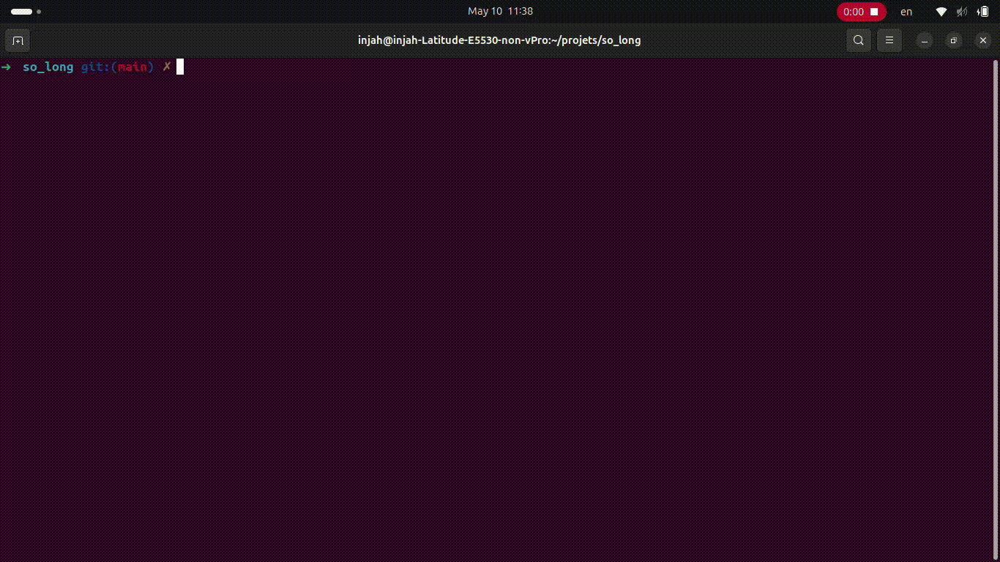

# so_long
[Voir le sujet](./subject.pdf)

Projet de niveau 3 de l'école 42.

Création d’un petit jeu en 2D utilisant la bibliothèque MiniLibX, avec déplacements, collecte d’objets et sortie conditionnelle.

Version de partie de base:

Version de partie bonus: +Animations +Ennemis

