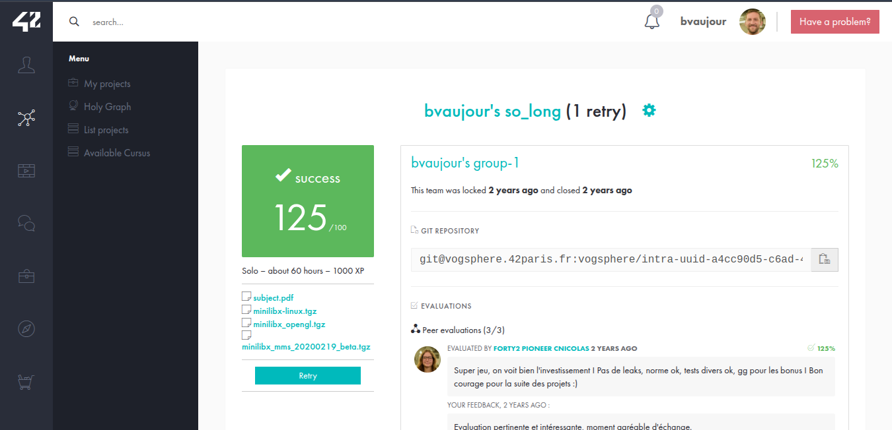

# so_long

Projet de niveau 3 de l'école 42.

Création d’un petit jeu en 2D utilisant la bibliothèque MiniLibX, avec déplacements, collecte d’objets et sortie conditionnelle.

[Voir le sujet](./subject.pdf)

